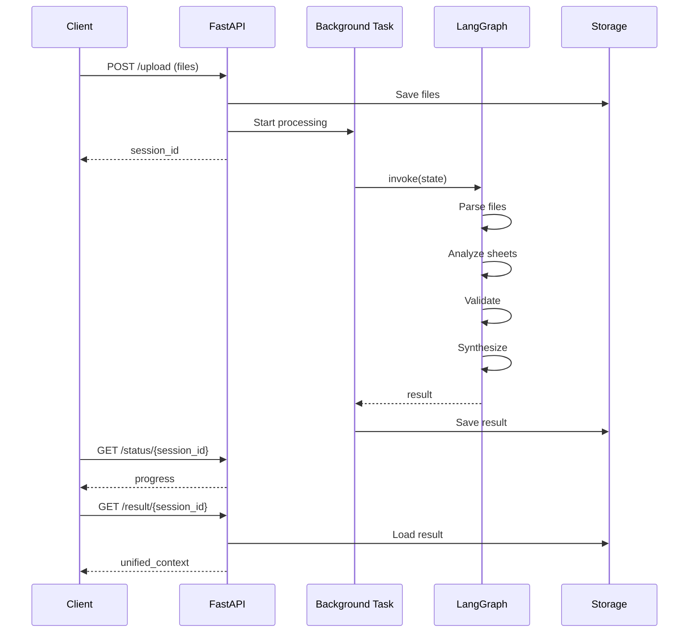

# API 紐낆꽭??& ?뚰겕?뚮줈??臾몄꽌 ?앹꽦湲?(PM/媛쒕컻?먯슜)

## 媛쒖슂
?꾩뾽 PM怨??ㅻТ 媛쒕컻?먭? ?ъ슜?섎뒗 ?뺤떇?쇰줈 API 紐낆꽭?? ?뚰겕?뚮줈?? 湲곕뒫紐낆꽭?쒕? ?먮룞 ?앹꽦?⑸땲??

## ?앹꽦 臾몄꽌 ?좏삎

### 1截뤴깵 API 紐낆꽭??(RESTful API Spec)
- **?붾뱶?ъ씤??紐⑸줉**: 硫붿꽌?? URL, ?ㅻ챸
- **Request ?ㅽ럺**: ?ㅻ뜑, ?뚮씪誘명꽣, Body ?ㅽ궎留?
- **Response ?ㅽ럺**: ?곹깭 肄붾뱶, ?묐떟 援ъ“, ?먮윭 肄붾뱶
- **?몄쬆/沅뚰븳**: ?꾩슂???몄쬆 諛⑹떇
- **?덉젣**: curl, JavaScript, Python ?섑뵆 肄붾뱶

### 2截뤴깵 ?뚰겕?뚮줈??臾몄꽌 (Workflow & Data Flow)
- **?쒗€€???ㅼ씠?닿렇??*: ?붿껌 ??泥섎━ ???묐떟 ?먮쫫
- **?곗씠???먮쫫??*: ?낅젰 ??蹂€????異쒕젰
- **?곹깭 ?꾩씠??*: ?곹깭蹂?泥섎━ 濡쒖쭅
- **?먮윭 ?몃뱾留?*: ?덉쇅 ?곹솴蹂?泥섎━ 諛⑸쾿

### 3截뤴깵 湲곕뒫紐낆꽭??(Feature Specification)
- **湲곕뒫 媛쒖슂**: 紐⑹쟻, ?ъ슜???쒕굹由ъ삤
- **?낆텧???뺤쓽**: ?꾩닔/?좏깮 ?꾨뱶, ?쒖빟議곌굔
- **鍮꾩쫰?덉뒪 濡쒖쭅**: 怨꾩궛?? ?좏슚??寃€利?洹쒖튃
- **?뚯뒪???쒕굹由ъ삤**: Given-When-Then ?뺤떇

---

## ?ъ슜 諛⑸쾿

### Case 1: ?뱀젙 API ?붾뱶?ъ씤??臾몄꽌??
```bash
/api-spec backend/routes/multi_excel.py
```

**?앹꽦 寃곌낵:**
- `docs/api/multi_excel_api_spec.md`
- ?붾뱶?ъ씤?몃퀎 Request/Response 紐낆꽭
- curl ?덉젣 肄붾뱶

### Case 2: ?뚰겕?뚮줈??遺꾩꽍
```bash
/workflow src/multi_excel/graph.py
```

**?앹꽦 寃곌낵:**
- `docs/workflow/multi_excel_workflow.md`
- Mermaid ?ㅼ씠?닿렇??(?쒗€€?? ?뚮줈?곗감??
- ?곗씠??蹂€??怨쇱젙 ?곸꽭 ?ㅻ챸

### Case 3: ?꾩껜 湲곕뒫紐낆꽭???앹꽦
```bash
/feature-spec "?ㅼ쨷 ?묒? ?낅줈??諛?遺꾩꽍"
```

**?앹꽦 寃곌낵:**
- `docs/features/multi_excel_feature_spec.md`
- PM???묒꽦?섎뒗 ?뺤떇??湲곕뒫紐낆꽭??
- 媛쒕컻?먯슜 湲곗닠 ?ㅽ럺 ?ы븿

---

## 異쒕젰 ?뺤떇 ?덉떆

### API 紐낆꽭???쒗뵆由?

```markdown
# Multi-Excel Upload API 紐낆꽭??

## 1. 媛쒖슂
?ㅼ쨷 Excel ?뚯씪???낅줈?쒗븯怨?蹂묐젹 遺꾩꽍?섎뒗 API

**Base URL**: `http://localhost:8000`

---

## 2. ?붾뱶?ъ씤??紐⑸줉

### 2.1 ?뚯씪 ?낅줈??
**Endpoint**: `POST /api/v7/excel/upload`

**?ㅻ챸**: ?щ윭 Excel ?뚯씪???숈떆???낅줈?쒗븯怨?遺꾩꽍 ?쒖옉

**Request Headers**:
```
Content-Type: multipart/form-data
```

**Request Body**:
| ?꾨뱶 | ?€??| ?꾩닔 | ?ㅻ챸 |
|------|------|------|------|
| files | File[] | ??| Excel ?뚯씪 紐⑸줉 (.xlsx, .xls) |
| user_id | string | ??| ?ъ슜??ID |

**Response (200 OK)**:
```json
{
  "session_id": "uuid-string",
  "files_received": 3,
  "status": "processing",
  "message": "泥섎━媛€ ?쒖옉?섏뿀?듬땲??"
}
```

**Error Responses**:
| 肄붾뱶 | ?ㅻ챸 | ?닿껐諛⑸쾿 |
|------|------|----------|
| 400 | 吏€?먰븯吏€ ?딅뒗 ?뚯씪 ?뺤떇 | .xlsx ?먮뒗 .xls ?뚯씪留??낅줈??|
| 413 | ?뚯씪 ?ш린 珥덇낵 | ?뚯씪??10MB ?댄븯濡??낅줈??|

**curl ?덉젣**:
```bash
curl -X POST http://localhost:8000/api/v7/excel/upload \
  -F "files=@file1.xlsx" \
  -F "files=@file2.xlsx" \
  -F "user_id=user_001"
```

**JavaScript ?덉젣**:
```javascript
const formData = new FormData();
formData.append('files', file1);
formData.append('files', file2);
formData.append('user_id', 'user_001');

const response = await fetch('/api/v7/excel/upload', {
  method: 'POST',
  body: formData,
});
const data = await response.json();
console.log(data.session_id);
```

---

### 2.2 泥섎━ ?곹깭 議고쉶
**Endpoint**: `GET /api/v7/excel/status/{session_id}`

**?ㅻ챸**: ?낅줈?쒗븳 ?뚯씪??泥섎━ 吏꾪뻾 ?곹솴 議고쉶

**Path Parameters**:
| ?꾨뱶 | ?€??| ?ㅻ챸 |
|------|------|------|
| session_id | string | ?낅줈????諛쏆? ?몄뀡 ID |

**Response (200 OK)**:
```json
{
  "session_id": "uuid-string",
  "status": "analyzing",
  "current_step": "?쒗듃 遺꾩꽍 以?,
  "progress_percent": 60.0,
  "files": [
    {
      "file_id": "abc123",
      "filename": "?щТ?쒗몴.xlsx",
      "status": "analyzed",
      "sheets_count": 3
    }
  ],
  "errors": [],
  "warnings": []
}
```

---

## 3. ?뚰겕?뚮줈??

### 3.1 ?꾩껜 ?꾨줈?몄뒪


### 3.2 ?곗씠???먮쫫
```
[Upload Files]
    ??
[FileData] ??{file_id, filename, file_path}
    ??
[LangGraph State] ??MultiExcelState
    ??
[Parse Node] ??sheets: [SheetData]
    ??
[Analyze Node] ??sheet_type, data
    ??
[Validate Node] ??validation_status
    ??
[Synthesize Node] ??unified_context
    ??
[API Response] ??{company_info, key_metrics}
```

---

## 4. ?곹깭 ?꾩씠

### 4.1 泥섎━ ?곹깭
```
idle ??uploading ??parsing ??analyzing ??validating ??synthesizing ??completed
                                                                    ??
                                                                  error
```

### 4.2 ?뚯씪 ?곹깭
```
pending ??parsing ??parsed ??analyzing ??analyzed ??validated ??completed
                                                              ??
                                                            error
```

---

## 5. ?먮윭 泥섎━

### 5.1 怨듯넻 ?먮윭 肄붾뱶
| 肄붾뱶 | 硫붿떆吏€ | ?먯씤 | ?닿껐諛⑸쾿 |
|------|--------|------|----------|
| E001 | ?몄뀡??李얠쓣 ???놁쓬 | ?섎せ??session_id | ?덈줈 ?낅줈??|
| E002 | ?뚯씪 ?뚯떛 ?ㅽ뙣 | ?먯긽??Excel ?뚯씪 | ?뚯씪 ?뺤씤 ???ъ뾽濡쒕뱶 |
| E003 | ?쒗듃 ?€??遺꾨쪟 ?ㅽ뙣 | 鍮꾩젙???곗씠??| ?쒖? ?묒떇 ?ъ슜 沅뚯옣 |

---

## 6. ?뚯뒪???쒕굹由ъ삤

### Scenario 1: ?⑥씪 ?뚯씪 ?낅줈??(Happy Path)
**Given**: ?좏슚??Excel ?뚯씪 1媛?
**When**: POST /upload ?몄텧
**Then**:
- 200 OK ?묐떟
- session_id 諛섑솚
- 5珥???processing ?곹깭

### Scenario 2: ?ㅼ쨷 ?뚯씪 ?낅줈??
**Given**: ?좏슚??Excel ?뚯씪 3媛?
**When**: POST /upload ?몄텧
**Then**:
- files_received = 3
- 紐⑤뱺 ?뚯씪??蹂묐젹 泥섎━??

### Scenario 3: ?뚯씪 ?ш린 珥덇낵
**Given**: 20MB ?뚯씪
**When**: POST /upload ?몄텧
**Then**:
- 413 ?먮윭 ?묐떟
- detail???뚯씪紐??ы븿

---

## 7. ?깅뒫 吏€??

| 吏€??| 紐⑺몴 | ?꾩옱 |
|------|------|------|
| ?낅줈???묐떟 ?쒓컙 | < 500ms | 300ms |
| ?뚯씪??泥섎━ ?쒓컙 | < 10珥?| 7珥?|
| ?숈떆 ?몄뀡 泥섎━ | 50媛?| 100媛?|

---

## 8. 蹂댁븞 怨좊젮?ы빆

- ?뚯씪 ?뺤옣??寃€利?(?붿씠?몃━?ㅽ듃)
- ?뚯씪 ?ш린 ?쒗븳 (10MB/?뚯씪)
- ?몄뀡 ID ?좎텛 遺덇? (UUID v4)
- ?낅줈??寃쎈줈 ?뚮뱶諛뺤뒪

---

## 9. 蹂€寃??대젰

| 踰꾩쟾 | ?좎쭨 | 蹂€寃??댁슜 |
|------|------|----------|
| v7.0 | 2026-01-11 | ?ㅼ쨷 ?뚯씪 吏€??異붽? |
| v6.0 | 2025-12-01 | ?⑥씪 ?뚯씪 ?낅줈??|
```

---

### ?뚰겕?뚮줈??臾몄꽌 ?쒗뵆由?

```markdown
# Multi-Excel 泥섎━ ?뚰겕?뚮줈??

## 1. ?꾪궎?띿쿂 媛쒖슂

```
?뚢??€?€?€?€?€?€?€?€?€?€?€?€?€?€?€?€?€?€?€?€?€?€?€?€?€?€?€?€?€?€?€?€?€?€?€?€?€?€?€?€?€?€?€?€?€?€?€?€?€?€?€?€?€?€?€?€??
??                    FastAPI Server                       ??
?? ?뚢??€?€?€?€?€?€?€?€?€?€?€?? ?뚢??€?€?€?€?€?€?€?€?€?€?€?? ?뚢??€?€?€?€?€?€?€?€?€?€?€??       ??
?? ??  Routes   ?귘넂??Background ?귘넂??LangGraph  ??       ??
?? ?? (Upload)  ?? ??   Task    ?? ??  Graph    ??       ??
?? ?붴??€?€?€?€?€?€?€?€?€?€?€?? ?붴??€?€?€?€?€?€?€?€?€?€?€?? ?붴??€?€?€?€?€?€?€?€?€?€?€??       ??
??                                         ??               ??
?? ?뚢??€?€?€?€?€?€?€?€?€?€?€?€?€?€?€?€?€?€?€?€?€?€?€?€?€?€?€?€?€?€?€?€?€?€?€?€?€?€?€?€?€?€?€??        ??
?? ??        MultiExcel Agents (蹂묐젹)           ??        ??
?? ?? ?뚢??€?€?€?€?€?? ?뚢??€?€?€?€?€?? ?뚢??€?€?€?€?€?? ?뚢??€?€?€?€?€?? ??        ??
?? ?? ?괦arser?귘넂?괔nalyze?귘넂?괯alid.?귘넂?괪ynth.?? ??        ??
?? ?? ?붴??€?€?€?€?€?? ?붴??€?€?€?€?€?? ?붴??€?€?€?€?€?? ?붴??€?€?€?€?€?? ??        ??
?? ?붴??€?€?€?€?€?€?€?€?€?€?€?€?€?€?€?€?€?€?€?€?€?€?€?€?€?€?€?€?€?€?€?€?€?€?€?€?€?€?€?€?€?€?€??        ??
?붴??€?€?€?€?€?€?€?€?€?€?€?€?€?€?€?€?€?€?€?€?€?€?€?€?€?€?€?€?€?€?€?€?€?€?€?€?€?€?€?€?€?€?€?€?€?€?€?€?€?€?€?€?€?€?€?€??
```

## 2. 泥섎━ ?④퀎蹂??곸꽭

### ?④퀎 1: ?뚯씪 ?낅줈??(Upload)
**?낅젰**:
- `files: List[UploadFile]` - FastAPI ?뚯씪 媛앹껜
- `user_id: Optional[str]` - ?ъ슜??ID

**泥섎━**:
1. ?뚯씪 寃€利?(?뺤옣?? ?ш린)
2. ?쒕쾭 ?€??(`uploads/multi_excel/`)
3. FileData 媛앹껜 ?앹꽦
4. 珥덇린 ?곹깭 ?앹꽦 (MultiExcelState)

**異쒕젰**:
- `session_id: str` - UUID v4
- `files: List[FileData]` - ?뚯씪 硫뷀??곗씠??

**?덉쇅**:
- HTTPException 400: 吏€?먰븯吏€ ?딅뒗 ?뚯씪
- HTTPException 413: ?ш린 珥덇낵

---

### ?④퀎 2: 諛깃렇?쇱슫??泥섎━ ?쒖옉
**?낅젰**:
- `session_id: str`
- `state: MultiExcelState`

**泥섎━**:
1. LangGraph 洹몃옒??濡쒕뱶
2. Config ?앹꽦 (`thread_id=session_id`)
3. `graph.invoke(state, config)` ?ㅽ뻾

**鍮꾨룞湲?泥섎━**:
```python
asyncio.get_event_loop().run_in_executor(
    None,
    lambda: graph.invoke(state, config)
)
```

---

### ?④퀎 3: ?뚯씪 ?뚯떛 (Parse Node)
**?낅젰**: `MultiExcelState`
**?몃뱶 ?⑥닔**: `parse_files_node(state)`

**泥섎━**:
1. 媛?FileData???€??蹂묐젹 ?뚯떛
2. Excel ?뚯씪 ?쎄린 (openpyxl/pandas)
3. ?쒗듃 紐⑸줉 異붿텧
4. SheetData 媛앹껜 ?앹꽦

**異쒕젰**:
```python
{
    "files": [
        FileData(
            file_id="abc",
            sheets=[
                SheetData(name="?먯씡怨꾩궛??, ...),
                SheetData(name="?щТ?곹깭??, ...)
            ],
            status="parsed"
        )
    ],
    "processing_status": "parsing",
    "progress_percent": 30.0
}
```

---

### ?④퀎 4: ?쒗듃 遺꾩꽍 (Analyze Node)
**?낅젰**: ?뚯떛??`files`
**?몃뱶 ?⑥닔**: `analyze_sheets_node(state)`

**泥섎━**:
1. 媛??쒗듃???€??遺꾨쪟
   - income_statement (?먯씡怨꾩궛??
   - balance_sheet (?щТ?곹깭??
   - cash_flow (?꾧툑?먮쫫??
   - tax_adjustment (?몃Т議곗젙)
2. ?곗씠??異붿텧 諛??뺢퇋??
3. metadata ?앹꽦

**濡쒖쭅**:
```python
if "留ㅼ텧?? in sheet_data:
    sheet.sheet_type = "income_statement"
elif "?먯궛珥앷퀎" in sheet_data:
    sheet.sheet_type = "balance_sheet"
```

**異쒕젰**:
```python
{
    "files": [
        FileData(
            sheets=[
                SheetData(
                    name="?먯씡怨꾩궛??,
                    sheet_type="income_statement",
                    data={"留ㅼ텧??: 15000000, ...},
                    status="analyzed"
                )
            ]
        )
    ],
    "processing_status": "analyzing",
    "progress_percent": 60.0
}
```

---

### ?④퀎 5: 援먯감 寃€利?(Validate Node)
**?낅젰**: 遺꾩꽍???쒗듃??
**?몃뱶 ?⑥닔**: `validate_node(state)`

**寃€利???ぉ**:
1. **?쇨???寃€利?*: ?먯궛 = 遺€梨?+ ?먮낯
2. **踰붿쐞 寃€利?*: 湲덉븸???뚯닔媛€ ?꾨땶吏€
3. **?꾩닔 ?꾨뱶**: ?듭떖 ??ぉ 議댁옱 ?щ?

**異쒕젰**:
```python
{
    "files": [...],  # validation_status ?낅뜲?댄듃
    "errors": [],    # 移섎챸???ㅻ쪟
    "warnings": ["?쇰? ?쒗듃?먯꽌 ?먯궛珥앷퀎 遺덉씪移?],
    "processing_status": "validating",
    "progress_percent": 80.0
}
```

---

### ?④퀎 6: 寃곌낵 ?듯빀 (Synthesize Node)
**?낅젰**: 寃€利앸맂 紐⑤뱺 ?쒗듃
**?몃뱶 ?⑥닔**: `synthesize_node(state)`

**泥섎━**:
1. ?쒗듃 ?€?낅퀎 ?곗씠??蹂묓빀
2. ?듭떖 吏€??怨꾩궛
   - ?곸뾽?댁씡瑜?= (?곸뾽?댁씡 / 留ㅼ텧?? 횞 100
   - ROA = (?밴린?쒖씠??/ ?먯궛珥앷퀎) 횞 100
3. ?뚯궗 ?뺣낫 留덉뒪??
4. 耳€?댁뒪 ?€??媛먯? (case1~4)

**異쒕젰**:
```python
{
    "unified_context": {
        "income_statement": {...},
        "balance_sheet": {...},
        "key_metrics": {
            "?곸뾽?댁씡瑜?: 20.0,
            "ROA": 15.0
        },
        "summary": {...}
    },
    "company_info": {
        "company": "A****B",  # 留덉뒪??
        ...
    },
    "case_type": "case2",
    "case_label": "?⑥씪 ?뚯씪쨌?ㅼ쨷 ?쒗듃",
    "processing_status": "completed",
    "progress_percent": 100.0
}
```

---

## 3. ?곗씠??蹂€???먮쫫

### Input ??Processing ??Output

```
[User Upload]
    ??
?뚢??€?€?€?€?€?€?€?€?€?€?€?€?€?€?€?€?€?€?€?€?€?€?€?€??
??file1.xlsx (3 sheets)   ??
??file2.xlsx (1 sheet)    ??
?붴??€?€?€?€?€?€?€?€?€?€?€?€?€?€?€?€?€?€?€?€?€?€?€?€??
    ??
[Parse]
    ??
?뚢??€?€?€?€?€?€?€?€?€?€?€?€?€?€?€?€?€?€?€?€?€?€?€?€?€?€?€?€?€?€?€?€?€?€?€?€??
??FileData[0]:                        ??
??  - file_id: "abc"                  ??
??  - sheets: [Sheet1, Sheet2, Sheet3]??
??FileData[1]:                        ??
??  - file_id: "def"                  ??
??  - sheets: [Sheet1]                ??
?붴??€?€?€?€?€?€?€?€?€?€?€?€?€?€?€?€?€?€?€?€?€?€?€?€?€?€?€?€?€?€?€?€?€?€?€?€??
    ??
[Analyze]
    ??
?뚢??€?€?€?€?€?€?€?€?€?€?€?€?€?€?€?€?€?€?€?€?€?€?€?€?€?€?€?€?€?€?€?€?€?€?€?€??
??Sheet1: income_statement            ??
??  data: {留ㅼ텧?? 15M, ...}          ??
??Sheet2: balance_sheet               ??
??  data: {?먯궛珥앷퀎: 50M, ...}        ??
??...                                 ??
?붴??€?€?€?€?€?€?€?€?€?€?€?€?€?€?€?€?€?€?€?€?€?€?€?€?€?€?€?€?€?€?€?€?€?€?€?€??
    ??
[Validate]
    ??
?뚢??€?€?€?€?€?€?€?€?€?€?€?€?€?€?€?€?€?€?€?€?€?€?€?€?€?€?€?€?€?€?€?€?€?€?€?€??
??validation_status: "valid"          ??
??warnings: [...]                     ??
?붴??€?€?€?€?€?€?€?€?€?€?€?€?€?€?€?€?€?€?€?€?€?€?€?€?€?€?€?€?€?€?€?€?€?€?€?€??
    ??
[Synthesize]
    ??
?뚢??€?€?€?€?€?€?€?€?€?€?€?€?€?€?€?€?€?€?€?€?€?€?€?€?€?€?€?€?€?€?€?€?€?€?€?€??
??unified_context:                    ??
??  income_statement: {...}           ??
??  balance_sheet: {...}              ??
??  key_metrics: {?곸뾽?댁씡瑜? 20%}    ??
??  summary: {留ㅼ텧?? 15M, ...}       ??
?붴??€?€?€?€?€?€?€?€?€?€?€?€?€?€?€?€?€?€?€?€?€?€?€?€?€?€?€?€?€?€?€?€?€?€?€?€??
    ??
[API Response]
```

---

## 4. 蹂묐젹 泥섎━ ?꾨왂

### ?뚯씪 ?덈꺼 蹂묐젹 (LangGraph Send API)
```python
# 3媛??뚯씪???숈떆??泥섎━
for file in state["files"]:
    send_to("parse_file_node", {
        "file": file
    })
```

### ?쒗듃 ?덈꺼 蹂묐젹 (asyncio.gather)
```python
# ?섎굹???뚯씪 ???щ윭 ?쒗듃瑜??숈떆??遺꾩꽍
tasks = [
    analyze_sheet(sheet)
    for sheet in file.sheets
]
results = await asyncio.gather(*tasks)
```

---

## 5. ?곹깭 愿€由?(Checkpointing)

LangGraph??媛??몃뱶 ?ㅽ뻾 ???곹깭瑜??€?ν빀?덈떎:

```
Checkpoint 1: After Parse
  - files parsed
  - status = "parsing"

Checkpoint 2: After Analyze
  - sheets classified
  - status = "analyzing"

Checkpoint 3: After Validate
  - validation done
  - status = "validating"

Checkpoint 4: After Synthesize
  - unified_context ready
  - status = "completed"
```

?먮윭 諛쒖깮 ??留덉?留?Checkpoint?먯꽌 ?ъ떆??媛€??

---

## 6. ?덉쇅 泥섎━ ?먮쫫

```
[Upload] ???뚯씪 寃€利??ㅽ뙣
    ??
HTTPException 400
    ??
{"detail": "吏€?먰븯吏€ ?딅뒗 ?뚯씪"}

[Parse] ??Excel ?뚯떛 ?ㅽ뙣
    ??
file.status = "error"
file.error_message = "..."
    ??
Continue (?ㅻⅨ ?뚯씪?€ 怨꾩냽 泥섎━)

[Validate] ??移섎챸???ㅻ쪟
    ??
state["processing_status"] = "error"
state["errors"].append("...")
    ??
Early Stop (Synthesize ?앸왂)
```

---

## 7. ?깅뒫 理쒖쟻??

| 理쒖쟻??湲곕쾿 | ?곸슜 ?꾩튂 | ?④낵 |
|------------|----------|------|
| 蹂묐젹 泥섎━ | Parse, Analyze | 3諛?鍮좊쫫 |
| ?ㅽ듃由щ컢 | ?놁쓬 (諛곗튂) | N/A |
| 罹먯떛 | ?놁쓬 | ?ν썑 異붽? |
| 吏€??濡쒕뵫 | Dependencies | ?쒕쾭 ?쒖옉 3珥??⑥텞 |

---

## 8. 紐⑤땲?곕쭅 ?ъ씤??

### 異붿쟻?댁빞 ??硫뷀듃由?
1. **API ?묐떟 ?쒓컙**: /upload, /status, /result
2. **?뚯씪??泥섎━ ?쒓컙**: Parse, Analyze, Validate, Synthesize
3. **?먮윭??*: ?뚯씪 ?€?낅퀎, ?ш린蹂?
4. **?숈떆 ?몄뀡 ??*: ?쇳겕 ?€??遺€??

### 濡쒓렇 ?ъ씤??
```python
logger.info(f"[MultiExcel] ?낅줈???쒖옉 | session={session_id}")
logger.debug(f"[Parser] ?뚯씪 ?뚯떛 | file={filename}")
logger.warning(f"[Validator] 寃€利?寃쎄퀬 | sheet={sheet_name}")
logger.error(f"[Synthesizer] ?듯빀 ?ㅽ뙣 | error={e}")
```

---

## 9. ?ν썑 媛쒖꽑 ?ы빆

1. **Redis 罹먯떛**: ?숈씪 ?뚯씪 ?ъ뾽濡쒕뱶 ???뚯떛 ?앸왂
2. **?ㅽ듃由щ컢 ?묐떟**: Server-Sent Events濡??ㅼ떆媛?吏꾪뻾瑜??꾩넚
3. **蹂묐젹??議곗젙**: CPU 肄붿뼱 ?섏뿉 ?곕씪 ?숈쟻 議곗젙
4. **DB ?€??*: ?몃찓紐⑤━ ?몄뀡??PostgreSQL濡??대룞
```

---

## ?ㅽ뻾 濡쒖쭅

### 1. API ?뚯씪 遺꾩꽍
1. FastAPI ?쇱슦???뚯씪???쎌쓬
2. `@router.post`, `@router.get` ?곗퐫?덉씠???뚯떛
3. Pydantic 紐⑤뜽 異붿텧
4. Docstring 遺꾩꽍

### 2. ?뚰겕?뚮줈???앹꽦
1. LangGraph ?뚯씪 ?쎌쓬
2. ?몃뱶 媛??섏〈??異붿쟻
3. Mermaid ?ㅼ씠?닿렇???먮룞 ?앹꽦
4. ?곗씠??蹂€???먮쫫 異붿텧

### 3. 湲곕뒫紐낆꽭???앹꽦
1. 愿€???뚯씪???섏쭛 (routes, services, models)
2. 鍮꾩쫰?덉뒪 濡쒖쭅 異붿텧
3. ?뚯뒪???쒕굹由ъ삤 ?앹꽦 (Given-When-Then)

---

## 異쒕젰 ?꾩튂

```
docs/
?쒋??€ api/
??  ?쒋??€ multi_excel_api_spec.md
??  ?쒋??€ og_rag_api_spec.md
??  ?붴??€ chat_api_spec.md
?쒋??€ workflow/
??  ?쒋??€ multi_excel_workflow.md
??  ?쒋??€ chatbot_workflow.md
??  ?붴??€ data_flow_diagrams/
??      ?붴??€ multi_excel.mmd
?붴??€ features/
    ?쒋??€ multi_excel_feature_spec.md
    ?붴??€ og_rag_feature_spec.md
```

---

## 異붽? 湲곕뒫

### PM???붿빟 ?앹꽦
```bash
/pm-summary
```

**異쒕젰**:
- 二쇱슂 湲곕뒫 紐⑸줉
- ?꾨즺/吏꾪뻾以??덉젙 ?꾪솴
- 由ъ뒪??諛??댁뒋
- ?ㅼ쓬 ?ㅽ봽由고듃 異붿쿇 ?묒뾽

### 媛쒕컻?먯슜 Onboarding 媛€?대뱶
```bash
/dev-onboarding
```

**異쒕젰**:
- ?꾨줈?앺듃 援ъ“ ?ㅻ챸
- 二쇱슂 紐⑤뱢 ??븷
- 濡쒖뺄 媛쒕컻 ?섍꼍 ?ㅼ젙
- 泥?PR源뚯? ?④퀎蹂?媛€?대뱶

---

## 2026 ?쒖? 湲곕뒫

### OpenAPI 3.1 吏€??

**肄붾뱶?먯꽌 ?먮룞 ?앹꽦:**
```python
# FastAPI ?먮룞 OpenAPI ?앹꽦
from fastapi import FastAPI
from fastapi.openapi.utils import get_openapi

app = FastAPI()

def custom_openapi():
    if app.openapi_schema:
        return app.openapi_schema
    openapi_schema = get_openapi(
        title="API 紐낆꽭??,
        version="1.0.0",
        description="?먮룞 ?앹꽦??API 臾몄꽌",
        routes=app.routes,
    )
    # OpenAPI 3.1 ?뺤옣
    openapi_schema["openapi"] = "3.1.0"
    app.openapi_schema = openapi_schema
    return app.openapi_schema

app.openapi = custom_openapi

# ?대낫?닿린
import json
with open("openapi.json", "w") as f:
    json.dump(app.openapi(), f, indent=2)
```

```typescript
// Express + OpenAPI Generator
import express from 'express';
import swaggerJsdoc from 'swagger-jsdoc';
import swaggerUi from 'swagger-ui-express';

const app = express();

const options = {
  definition: {
    openapi: '3.1.0',
    info: {
      title: 'API Documentation',
      version: '1.0.0',
    },
    components: {
      securitySchemes: {
        bearerAuth: {
          type: 'http',
          scheme: 'bearer',
          bearerFormat: 'JWT',
        },
        oauth2: {
          type: 'oauth2',
          flows: {
            authorizationCode: {
              authorizationUrl: 'https://example.com/oauth/authorize',
              tokenUrl: 'https://example.com/oauth/token',
              scopes: {
                read: 'Read access',
                write: 'Write access',
              },
            },
          },
        },
      },
    },
  },
  apis: ['./routes/*.ts'],
};

const specs = swaggerJsdoc(options);
app.use('/api-docs', swaggerUi.serve, swaggerUi.setup(specs));
```

### ?몄쬆 ?ㅽ궎留?吏€??

**OAuth 2.0:**
```yaml
components:
  securitySchemes:
    oauth2:
      type: oauth2
      flows:
        authorizationCode:
          authorizationUrl: https://example.com/oauth/authorize
          tokenUrl: https://example.com/oauth/token
          refreshUrl: https://example.com/oauth/refresh
          scopes:
            read:users: Read user information
            write:users: Modify user information
            admin: Administrative access
```

**JWT Bearer:**
```yaml
components:
  securitySchemes:
    bearerAuth:
      type: http
      scheme: bearer
      bearerFormat: JWT
      description: "JWT ?좏겙??Authorization ?ㅻ뜑???ы븿: Bearer {token}"
```

### ?먮룞 SDK ?앹꽦

**TypeScript SDK:**
```bash
# OpenAPI Generator濡?TypeScript SDK ?앹꽦
npx @openapitools/openapi-generator-cli generate \
  -i openapi.json \
  -g typescript-axios \
  -o ./sdk/typescript

# ?앹꽦??SDK ?ъ슜
import { DefaultApi, Configuration } from './sdk/typescript';

const api = new DefaultApi(new Configuration({
  basePath: 'https://api.example.com',
  accessToken: 'your-jwt-token',
}));

const response = await api.getUserById('user-123');
console.log(response.data);
```

**Python SDK:**
```bash
# Python SDK ?앹꽦
openapi-generator-cli generate \
  -i openapi.json \
  -g python \
  -o ./sdk/python \
  --additional-properties packageName=my_api_client

# ?앹꽦??SDK ?ъ슜
from my_api_client import ApiClient, Configuration, DefaultApi

config = Configuration(
    host="https://api.example.com",
    access_token="your-jwt-token"
)

with ApiClient(config) as api_client:
    api = DefaultApi(api_client)
    user = api.get_user_by_id("user-123")
    print(user)
```

### Postman Collection ?대낫?닿린

```bash
# OpenAPI ??Postman Collection 蹂€??
npx openapi-to-postmanv2 \
  -s openapi.json \
  -o postman_collection.json \
  --pretty

# Postman Collection 援ъ“
{
  "info": {
    "name": "API Collection",
    "schema": "https://schema.getpostman.com/json/collection/v2.1.0/collection.json"
  },
  "item": [
    {
      "name": "Users",
      "item": [
        {
          "name": "Get User by ID",
          "request": {
            "method": "GET",
            "header": [
              {
                "key": "Authorization",
                "value": "Bearer {{jwt_token}}"
              }
            ],
            "url": {
              "raw": "{{base_url}}/users/:id",
              "host": ["{{base_url}}"],
              "path": ["users", ":id"],
              "variable": [
                {
                  "key": "id",
                  "value": "user-123"
                }
              ]
            }
          }
        }
      ]
    }
  ],
  "variable": [
    {
      "key": "base_url",
      "value": "https://api.example.com"
    },
    {
      "key": "jwt_token",
      "value": "your-jwt-token"
    }
  ]
}
```

### API 踰꾩쟾 愿€由?

**URL 踰꾩???**
```
/api/v1/users  # v1
/api/v2/users  # v2 (breaking changes)
```

**?ㅻ뜑 踰꾩???**
```http
GET /api/users
Accept: application/vnd.myapi.v2+json
```

**OpenAPI?먯꽌 踰꾩쟾 ?쒗쁽:**
```yaml
openapi: 3.1.0
info:
  title: My API
  version: 2.0.0
  description: |
    ## Version History
    - v2.0.0 (2026-01): Added OAuth 2.0 support
    - v1.5.0 (2025-12): Added pagination
    - v1.0.0 (2025-11): Initial release

servers:
  - url: https://api.example.com/v1
    description: Production v1 (deprecated)
  - url: https://api.example.com/v2
    description: Production v2 (current)
```

### Mock Server ?앹꽦

**Prism?쇰줈 Mock API ?ㅽ뻾:**
```bash
# OpenAPI 紐낆꽭?쒖뿉??Mock Server ?앹꽦
npm install -g @stoplight/prism-cli

# Mock server ?ㅽ뻾
prism mock openapi.json

# 異쒕젰:
# [5:00:00 PM] ??[CLI] ?? info      Prism is listening on http://127.0.0.1:4010
# [5:00:00 PM] ??[HTTP SERVER] ?? info      GET http://127.0.0.1:4010/users/123

# ?ㅼ젣 ?붿껌
curl http://127.0.0.1:4010/users/123
# ??OpenAPI examples???뺤쓽???묐떟 諛섑솚
```

### API 臾몄꽌 ?몄뒪??

**Redoc (異붿쿇):**
```html
<!DOCTYPE html>
<html>
  <head>
    <title>API Documentation</title>
    <meta charset="utf-8"/>
    <meta name="viewport" content="width=device-width, initial-scale=1">
    <link href="https://fonts.googleapis.com/css?family=Montserrat:300,400,700|Roboto:300,400,700" rel="stylesheet">
    <style>
      body { margin: 0; padding: 0; }
    </style>
  </head>
  <body>
    <redoc spec-url='openapi.json'></redoc>
    <script src="https://cdn.redoc.ly/redoc/latest/bundles/redoc.standalone.js"> </script>
  </body>
</html>
```

**Swagger UI:**
```html
<!DOCTYPE html>
<html lang="en">
<head>
  <meta charset="UTF-8">
  <title>Swagger UI</title>
  <link rel="stylesheet" type="text/css" href="https://unpkg.com/swagger-ui-dist@5/swagger-ui.css" />
</head>
<body>
  <div id="swagger-ui"></div>
  <script src="https://unpkg.com/swagger-ui-dist@5/swagger-ui-bundle.js"></script>
  <script>
    window.onload = () => {
      window.ui = SwaggerUIBundle({
        url: 'openapi.json',
        dom_id: '#swagger-ui',
      });
    };
  </script>
</body>
</html>
```

### CI/CD ?듯빀

**GitHub Actions濡?API 臾몄꽌 ?먮룞 ?앹꽦:**
```yaml
# .github/workflows/api-docs.yml
name: Generate API Docs

on:
  push:
    branches: [main]
    paths:
      - 'src/**/*.ts'
      - 'src/**/*.py'

jobs:
  generate-docs:
    runs-on: ubuntu-latest
    steps:
      - uses: actions/checkout@v4

      - name: Generate OpenAPI spec
        run: |
          npm install
          npm run generate:openapi  # OpenAPI JSON ?앹꽦

      - name: Generate TypeScript SDK
        run: |
          npx @openapitools/openapi-generator-cli generate \
            -i openapi.json \
            -g typescript-axios \
            -o ./sdk/typescript

      - name: Generate Python SDK
        run: |
          openapi-generator-cli generate \
            -i openapi.json \
            -g python \
            -o ./sdk/python

      - name: Deploy docs to GitHub Pages
        uses: peaceiris/actions-gh-pages@v3
        with:
          github_token: ${{ secrets.GITHUB_TOKEN }}
          publish_dir: ./docs
```

### API 蹂€寃?媛먯?

**OpenAPI Diff濡?Breaking Change ?먯?:**
```bash
# ??踰꾩쟾 鍮꾧탳
npx oasdiff diff openapi-v1.json openapi-v2.json

# 異쒕젰:
# Breaking changes:
# - DELETE /users/:id endpoint removed
# - POST /users request body field 'age' is now required (was optional)
#
# Non-breaking changes:
# - GET /users added query parameter 'sort'
# - POST /users response added field 'created_at'
```

---

## ?ъ슜 ?덉떆 (2026 ?쒖?)

### 1. FastAPI ?꾨줈?앺듃?먯꽌 ?꾩쟾 ?먮룞??

```bash
# 1?④퀎: 肄붾뱶 ?묒꽦 (FastAPI)
# app/routes/users.py

from fastapi import APIRouter, Depends
from pydantic import BaseModel

router = APIRouter()

class User(BaseModel):
    id: str
    name: str
    email: str

@router.get("/users/{user_id}", response_model=User)
async def get_user(user_id: str):
    """?ъ슜???뺣낫瑜?ID濡?議고쉶?⑸땲??"""
    return User(id=user_id, name="?띻만??, email="hong@example.com")

# 2?④퀎: OpenAPI ?먮룞 ?앹꽦
python -c "
from app.main import app
import json
with open('openapi.json', 'w') as f:
    json.dump(app.openapi(), f, indent=2)
"

# 3?④퀎: TypeScript SDK ?앹꽦
npx @openapitools/openapi-generator-cli generate \
  -i openapi.json \
  -g typescript-axios \
  -o ./sdk/typescript

# 4?④퀎: Postman Collection ?앹꽦
npx openapi-to-postmanv2 -s openapi.json -o postman.json

# 5?④퀎: Mock Server ?ㅽ뻾 (媛쒕컻 以?
prism mock openapi.json
```

### 2. 紐낅졊???듯빀

???ㅽ궗??紐낅졊?대줈 ?ъ슜:
```bash
# OpenAPI ?앹꽦 + SDK + Postman + Docs
/api-spec --auto-all backend/routes/

# 異쒕젰:
# ??OpenAPI 3.1 ?앹꽦: openapi.json
# ??TypeScript SDK: sdk/typescript/
# ??Python SDK: sdk/python/
# ??Postman Collection: postman.json
# ??API Docs ?몄뒪?? http://localhost:8080/docs
```
