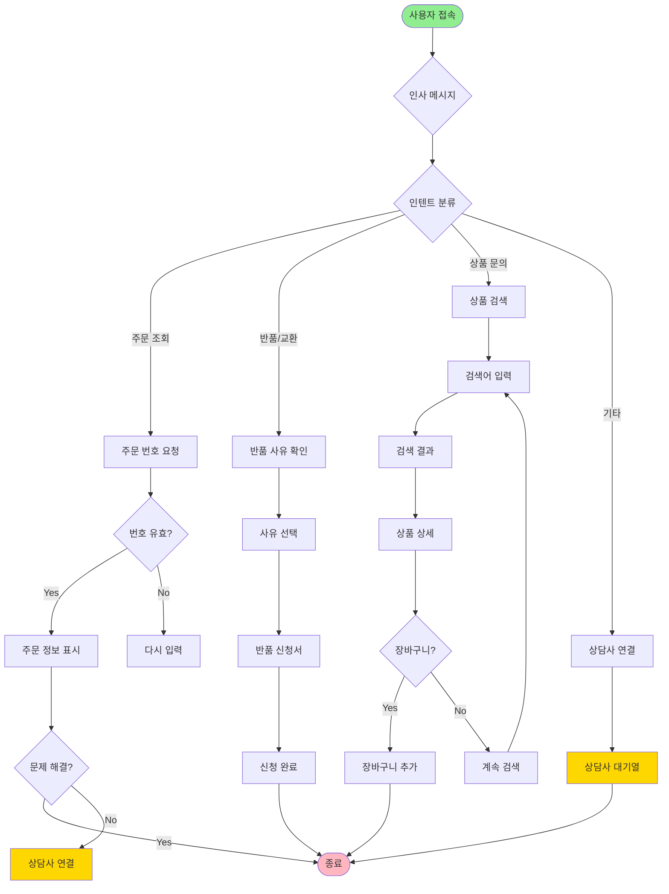

# 🤖 Chatbot Designer Skill

**Automated Dialog Flow and Intent Design for AI Chatbots**

> **English Summary:** Professional chatbot design automation skill. Automatically generates conversation flows (Mermaid diagrams), extracts and classifies intents/entities, creates FAQs, writes conversation scenarios, and defines performance metrics. Supports multi-platform export (Dialogflow, Rasa, Bot Framework).

---

**AI 챗봇 설계 전문 스킬 - 대화 플로우부터 인텐트까지 자동화**

## 개요

챗봇 설계의 모든 단계를 자동화하는 전문 스킬입니다:
- 대화 플로우 자동 생성 (Mermaid 다이어그램)
- 인텐트/엔티티 추출 및 분류
- FAQ 자동 생성
- 대화 시나리오 작성
- 성능 평가 지표 설정

## 사용 방법

### 기본 사용

```bash
/chatbot-designer "고객 지원 챗봇 (쇼핑몰)"
```

**자동 생성:**
1. 대화 플로우 다이어그램
2. 인텐트 분류 체계 (30+ 인텐트)
3. 엔티티 정의 (제품, 주문, 날짜 등)
4. FAQ 50개
5. 멀티턴 대화 시나리오
6. 성능 평가 계획

### 도메인별 템플릿

```bash
# 고객지원
/chatbot-designer --template customer-support "전자상거래"

# 영업/마케팅
/chatbot-designer --template sales "B2B SaaS"

# 사내 헬프데스크
/chatbot-designer --template internal "IT 헬프데스크"

# 교육/튜터
/chatbot-designer --template tutor "수학 과외"
```

---

## 1. 대화 플로우 설계

### 1.1 기본 플로우 구조



### 1.2 멀티턴 대화 예시

```markdown
## 시나리오 1: 주문 조회

**Turn 1**
User: 주문한 상품 언제 도착해요?
Bot: 주문 번호를 알려주시면 배송 상태를 확인해드릴게요!

**Turn 2**
User: 20260129-1234
Bot: 확인했습니다! 📦
     주문번호: 20260129-1234
     상품: MacBook Pro 14"
     배송 상태: 배송 중 (오늘 18:00 도착 예정)
     택배사: CJ대한통운 (송장: 123456789)

     실시간 위치 추적: [링크]

     다른 도움이 필요하신가요?

**Turn 3**
User: 배송 주소 변경할 수 있나요?
Bot: 죄송합니다. 이미 배송이 시작되어 주소 변경이 어렵습니다 😢

     대신 이렇게 도와드릴 수 있어요:
     1. 택배기사님께 직접 전화 (010-1234-5678)
     2. 반송 후 재배송 (추가 비용 발생)

     어떻게 도와드릴까요?

---

## 시나리오 2: 상품 추천

**Turn 1**
User: 노트북 추천해줘
Bot: 어떤 용도로 사용하실 건가요? 🤔
     1. 업무/사무 (문서, 이메일)
     2. 영상 편집 (프리미어, 파이널컷)
     3. 게임 (고사양 게임)
     4. 프로그래밍 (개발 작업)

**Turn 2**
User: 2번
Bot: 영상 편집용이시군요! 🎬
     예산은 어느 정도이신가요?
     1. ~150만원
     2. 150-250만원
     3. 250-400만원
     4. 400만원+

**Turn 3**
User: 3번
Bot: 250-400만원 예산으로 영상 편집에 최적화된 노트북 3가지 추천드립니다!

     🥇 **MacBook Pro 14" M3 Pro** (320만원)
     - CPU: Apple M3 Pro (12코어)
     - GPU: 18코어 (ProRes 가속)
     - RAM: 18GB
     - SSD: 512GB
     - ⭐ Final Cut Pro 최적화, 배터리 18시간

     🥈 **LG gram Style 16"** (280만원)
     - CPU: Intel i7-13700H
     - GPU: RTX 4050 (6GB)
     - RAM: 32GB
     - SSD: 1TB
     - ⭐ 가벼움 (1.2kg), 대용량 RAM

     🥉 **Dell XPS 15** (350만원)
     - CPU: Intel i9-13900H
     - GPU: RTX 4060 (8GB)
     - RAM: 32GB
     - SSD: 1TB
     - ⭐ 4K OLED 디스플레이, 강력한 성능

     자세한 비교표를 보시겠어요? [링크]

**Turn 4**
User: 1번 상세 설명 좀
Bot: MacBook Pro 14" M3 Pro 상세 정보입니다! 🍎

     [상품 이미지]

     **핵심 스펙:**
     - 무게: 1.6kg (휴대 편리)
     - 화면: 14.2" Liquid Retina XDR (3024x1964)
     - 포트: Thunderbolt 4 ×3, HDMI, SD카드
     - 배터리: 최대 18시간 (실사용 12-14시간)

     **영상 편집 성능:**
     - 4K ProRes: 18 스트림 실시간 재생
     - 8K H.264: 3 스트림
     - After Effects 렌더링: 경쟁 제품 대비 2.5배 빠름

     **리뷰 요약 (4.8/5.0):**
     - 장점: 배터리, 조용함, 화면 품질
     - 단점: 가격, 업그레이드 불가

     장바구니에 담으시겠어요?

**Turn 5**
User: 응
Bot: 장바구니에 추가했습니다! 🛒

     현재 장바구니:
     1. MacBook Pro 14" M3 Pro - 3,200,000원

     총액: 3,200,000원

     바로 결제하시겠어요? 아니면 더 둘러보시겠어요?
```

---

## 2. 인텐트 분류 체계

### 2.1 인텐트 정의 (쇼핑몰 예시)

```json
{
  "intents": [
    {
      "intent_id": "order.check",
      "intent_name": "주문 조회",
      "description": "사용자가 주문 상태, 배송 정보를 확인하려는 의도",
      "examples": [
        "주문한 거 언제 와요?",
        "배송 조회",
        "내 주문 확인",
        "주문 번호 12345 어디쯤 왔어?",
        "언제 도착해요"
      ],
      "required_entities": ["order_number"],
      "optional_entities": ["delivery_date"],
      "response_template": "주문 번호 {order_number}의 배송 상태는 {status}입니다. {expected_date}에 도착 예정입니다.",
      "confidence_threshold": 0.85
    },
    {
      "intent_id": "return.request",
      "intent_name": "반품/교환 신청",
      "description": "제품 반품 또는 교환을 원하는 의도",
      "examples": [
        "반품하고 싶어요",
        "교환 가능한가요?",
        "환불 받고 싶습니다",
        "사이즈가 안 맞아서 바꾸고 싶어요",
        "불량품이에요"
      ],
      "required_entities": ["order_number", "return_reason"],
      "optional_entities": ["product_id", "return_type"],
      "response_template": "반품 신청이 접수되었습니다. {return_process}",
      "confidence_threshold": 0.80
    },
    {
      "intent_id": "product.search",
      "intent_name": "상품 검색",
      "description": "특정 제품을 찾거나 추천받고 싶은 의도",
      "examples": [
        "노트북 보여줘",
        "아이폰 14 있어?",
        "여름 원피스 추천",
        "무선 이어폰 중에 뭐가 좋아?",
        "100만원 이하 노트북"
      ],
      "required_entities": ["product_category"],
      "optional_entities": ["brand", "price_range", "features"],
      "response_template": "{product_category} 검색 결과입니다. [상품 리스트]",
      "confidence_threshold": 0.75
    },
    {
      "intent_id": "recommendation.request",
      "intent_name": "추천 요청",
      "description": "상품 추천을 원하는 의도",
      "examples": [
        "추천해줘",
        "뭐가 좋아?",
        "베스트셀러 보여줘",
        "인기 상품",
        "요즘 잘 나가는 거"
      ],
      "required_entities": [],
      "optional_entities": ["product_category", "use_case", "budget"],
      "response_template": "{criteria} 기준 추천 상품입니다.",
      "confidence_threshold": 0.70
    },
    {
      "intent_id": "cart.add",
      "intent_name": "장바구니 추가",
      "description": "제품을 장바구니에 담으려는 의도",
      "examples": [
        "장바구니에 담아줘",
        "카트에 넣어줘",
        "이거 사고 싶어",
        "담기",
        "구매하고 싶어요"
      ],
      "required_entities": ["product_id"],
      "optional_entities": ["quantity"],
      "response_template": "{product_name}을(를) 장바구니에 추가했습니다!",
      "confidence_threshold": 0.90
    },
    {
      "intent_id": "payment.process",
      "intent_name": "결제 진행",
      "description": "장바구니 제품을 결제하려는 의도",
      "examples": [
        "결제할게요",
        "구매하기",
        "결제 진행",
        "지금 사고 싶어요",
        "바로 결제"
      ],
      "required_entities": [],
      "optional_entities": ["payment_method"],
      "response_template": "결제 페이지로 이동합니다. [링크]",
      "confidence_threshold": 0.95
    },
    {
      "intent_id": "faq.shipping",
      "intent_name": "배송 정책 문의",
      "description": "배송비, 배송 기간 등 배송 정책에 대한 질문",
      "examples": [
        "배송비 얼마예요?",
        "무료 배송 조건",
        "배송 며칠 걸려요?",
        "당일 배송 되나요?",
        "제주도 배송 가능?"
      ],
      "required_entities": [],
      "optional_entities": ["region"],
      "response_template": "{shipping_policy_answer}",
      "confidence_threshold": 0.75
    },
    {
      "intent_id": "faq.coupon",
      "intent_name": "쿠폰/할인 문의",
      "description": "쿠폰, 할인 이벤트에 대한 질문",
      "examples": [
        "쿠폰 있어?",
        "할인 행사 언제 해요?",
        "적립금 사용 방법",
        "신규 가입 혜택",
        "회원 등급 혜택"
      ],
      "required_entities": [],
      "optional_entities": ["coupon_type"],
      "response_template": "{coupon_info}",
      "confidence_threshold": 0.80
    },
    {
      "intent_id": "account.issue",
      "intent_name": "계정/로그인 문제",
      "description": "로그인, 비밀번호 찾기 등 계정 관련 문제",
      "examples": [
        "로그인이 안 돼요",
        "비밀번호 찾기",
        "아이디가 뭐였지?",
        "회원 탈퇴하고 싶어요",
        "정보 수정"
      ],
      "required_entities": [],
      "optional_entities": ["issue_type"],
      "response_template": "{account_help}",
      "confidence_threshold": 0.85
    },
    {
      "intent_id": "complaint",
      "intent_name": "불만/항의",
      "description": "서비스 불만, 항의 표현",
      "examples": [
        "화나요",
        "기분 나빠",
        "사기 아니에요?",
        "환불 안 해주면 신고할 거예요",
        "너무 불친절해요"
      ],
      "required_entities": [],
      "optional_entities": ["complaint_reason"],
      "response_template": "불편을 드려 죄송합니다. 상담사 연결해드리겠습니다.",
      "confidence_threshold": 0.70,
      "escalate_to_human": true
    },
    {
      "intent_id": "smalltalk.greeting",
      "intent_name": "인사",
      "description": "일반적인 인사 표현",
      "examples": [
        "안녕",
        "하이",
        "반가워",
        "hello",
        "처음 뵙겠습니다"
      ],
      "required_entities": [],
      "optional_entities": [],
      "response_template": "안녕하세요! 무엇을 도와드릴까요? 😊",
      "confidence_threshold": 0.90
    },
    {
      "intent_id": "smalltalk.thanks",
      "intent_name": "감사 표현",
      "description": "감사, 고마움 표현",
      "examples": [
        "고마워",
        "감사합니다",
        "땡큐",
        "도움이 됐어요",
        "잘 해결됐습니다"
      ],
      "required_entities": [],
      "optional_entities": [],
      "response_template": "천만에요! 또 궁금한 점 있으면 언제든 물어보세요 🙌",
      "confidence_threshold": 0.85
    },
    {
      "intent_id": "fallback",
      "intent_name": "이해 불가",
      "description": "챗봇이 이해하지 못한 경우",
      "examples": [],
      "required_entities": [],
      "optional_entities": [],
      "response_template": "죄송합니다, 잘 이해하지 못했어요. 다시 한번 말씀해주시겠어요?",
      "confidence_threshold": 0.00,
      "fallback": true
    }
  ]
}
```

### 2.2 엔티티 정의

```json
{
  "entities": [
    {
      "entity_id": "order_number",
      "entity_name": "주문 번호",
      "type": "pattern",
      "pattern": "^\\d{8}-\\d{4}$",
      "examples": [
        "20260129-1234",
        "20250315-5678"
      ],
      "validation": "YYYYMMDD-XXXX 형식"
    },
    {
      "entity_id": "product_category",
      "entity_name": "제품 카테고리",
      "type": "list",
      "values": [
        "노트북",
        "스마트폰",
        "태블릿",
        "이어폰",
        "키보드",
        "마우스",
        "모니터",
        "의류",
        "가전제품"
      ],
      "synonyms": {
        "노트북": ["랩탑", "컴퓨터", "맥북", "그램"],
        "스마트폰": ["폰", "핸드폰", "아이폰", "갤럭시"],
        "이어폰": ["에어팟", "버즈", "무선 이어폰", "TWS"]
      }
    },
    {
      "entity_id": "price_range",
      "entity_name": "가격 범위",
      "type": "slot",
      "format": "{min}~{max}만원",
      "examples": [
        "50~100만원",
        "100만원 이하",
        "200만원 이상"
      ],
      "extraction_method": "regex + NER"
    },
    {
      "entity_id": "brand",
      "entity_name": "브랜드",
      "type": "list",
      "values": [
        "Apple",
        "Samsung",
        "LG",
        "Dell",
        "HP",
        "Lenovo",
        "ASUS",
        "Sony",
        "Bose"
      ]
    },
    {
      "entity_id": "return_reason",
      "entity_name": "반품 사유",
      "type": "classification",
      "classes": [
        "단순 변심",
        "사이즈/색상 불만",
        "제품 불량",
        "배송 지연",
        "오배송",
        "기타"
      ]
    },
    {
      "entity_id": "delivery_date",
      "entity_name": "배송 날짜",
      "type": "datetime",
      "format": "YYYY-MM-DD",
      "relative": true,
      "examples": [
        "오늘",
        "내일",
        "이번 주",
        "다음 주 월요일",
        "2026-02-01"
      ]
    }
  ]
}
```

---

## 3. FAQ 자동 생성

```markdown
# FAQ - 자주 묻는 질문 (쇼핑몰)

## 주문/결제

### Q1. 주문은 어떻게 하나요?
**A:** 원하는 상품을 장바구니에 담고 "결제하기" 버튼을 클릭하세요. 로그인 후 배송지와 결제 수단을 선택하면 주문이 완료됩니다.

**관련 키워드:** 주문 방법, 구매 절차

---

### Q2. 결제 수단은 뭐가 있나요?
**A:** 신용카드, 체크카드, 계좌이체, 무통장입금, 휴대폰 결제, 네이버페이, 카카오페이를 지원합니다.

**관련 키워드:** 결제 방법, 카드 결제

---

### Q3. 주문 취소는 어떻게 하나요?
**A:** [마이페이지] → [주문내역] → [주문취소] 버튼을 클릭하세요. 배송 준비 중 상태에서만 취소 가능합니다. 이미 배송이 시작된 경우 반품 절차를 이용해주세요.

**관련 키워드:** 취소, 주문 취소 방법

---

## 배송

### Q4. 배송비는 얼마인가요?
**A:**
- 기본 배송비: 3,000원
- 무료 배송: 5만원 이상 구매 시
- 제주/도서산간: 추가 3,000원

**관련 키워드:** 배송비, 무료 배송

---

### Q5. 배송은 얼마나 걸리나요?
**A:**
- 일반 배송: 2-3일
- 새벽 배송: 다음 날 오전 7시 (서울/수도권)
- 당일 배송: 낮 12시 이전 주문 (일부 지역)

**관련 키워드:** 배송 기간, 언제 도착

---

### Q6. 배송 조회는 어디서 하나요?
**A:** [마이페이지] → [주문내역]에서 송장 번호를 클릭하면 실시간 배송 추적이 가능합니다. 또는 "주문 번호 XXXX 배송 조회"라고 챗봇에 물어보세요!

**관련 키워드:** 배송 추적, 택배 조회

---

## 반품/교환

### Q7. 반품/교환 기간은 언제까지인가요?
**A:**
- 상품 수령 후 7일 이내
- 단, 포장 개봉 또는 사용 흔적이 있는 경우 불가
- 전자제품: 개봉 시 반품 불가 (불량 제외)

**관련 키워드:** 반품 기간, 교환 가능 기간

---

### Q8. 반품 비용은 누가 부담하나요?
**A:**
- 단순 변심: 고객 부담 (편도 3,000원)
- 제품 불량/오배송: 무료 (판매자 부담)

**관련 키워드:** 반품 비용, 반품비

---

### Q9. 교환은 어떻게 하나요?
**A:** [마이페이지] → [주문내역] → [교환신청] → 사유 선택 → 신청 완료. 교환 상품 수령 후 7일 이내 신청 가능합니다.

**관련 키워드:** 교환 방법, 교환 신청

---

## 회원/계정

### Q10. 회원가입 혜택이 뭐예요?
**A:**
- 즉시 사용 가능한 3,000원 쿠폰
- 구매 금액의 1% 적립
- 생일 쿠폰 (5,000원)
- 회원 전용 세일 조기 액세스

**관련 키워드:** 회원 혜택, 가입 혜택

---

### Q11. 비밀번호를 잊어버렸어요.
**A:** [로그인] → [비밀번호 찾기] → 가입 시 등록한 이메일로 재설정 링크를 발송해드립니다.

**관련 키워드:** 비밀번호 찾기, 비밀번호 재설정

---

### Q12. 적립금은 어떻게 사용하나요?
**A:** 결제 시 "적립금 사용" 체크 → 사용할 금액 입력 → 1,000원 이상부터 사용 가능합니다.

**관련 키워드:** 적립금 사용, 포인트 사용

---

## 쿠폰/할인

### Q13. 쿠폰은 어디서 받나요?
**A:**
- [마이페이지] → [쿠폰함]
- 앱 푸시 알림 (이벤트 쿠폰)
- 이메일 뉴스레터
- SNS 이벤트 (인스타그램, 페이스북)

**관련 키워드:** 쿠폰 받기, 할인 쿠폰

---

### Q14. 쿠폰 중복 사용 가능한가요?
**A:** 동일 유형 쿠폰은 중복 사용 불가하지만, 카테고리별 쿠폰 + 배송비 쿠폰은 함께 사용 가능합니다.

**관련 키워드:** 쿠폰 중복, 여러 쿠폰

---

### Q15. 친구 추천 이벤트는 뭐예요?
**A:** 친구를 초대하면 친구는 10% 할인 쿠폰, 회원님은 5,000원 적립금을 받습니다! [친구 초대 링크]

**관련 키워드:** 친구 추천, 레퍼럴

---

## 상품

### Q16. 재입고 알림은 어떻게 받나요?
**A:** 품절 상품 페이지에서 "재입고 알림 신청" 클릭 → 재입고 시 카카오톡/이메일로 알림을 발송해드립니다.

**관련 키워드:** 재입고, 품절 상품

---

### Q17. 리뷰 작성하면 혜택이 있나요?
**A:** 포토 리뷰 작성 시 500 적립금, 일반 리뷰 100 적립금을 지급합니다. 베스트 리뷰 선정 시 추가 5,000원!

**관련 키워드:** 리뷰 혜택, 리뷰 적립금

---

### Q18. 상품 가격이 내렸는데 환불 받을 수 있나요?
**A:** 구매 후 7일 이내 가격 인하 시 차액을 적립금으로 환불해드립니다. 고객센터로 문의주세요!

**관련 키워드:** 가격 보상, 최저가 보상

---

## 고객센터

### Q19. 고객센터 운영 시간은?
**A:**
- 평일: 오전 9시 - 오후 6시
- 토요일: 오전 9시 - 오후 1시
- 일요일/공휴일: 휴무
- 챗봇: 24시간 연중무휴

**관련 키워드:** 고객센터 시간, 상담 시간

---

### Q20. 전화 상담은 어떻게 하나요?
**A:** 고객센터: 1588-XXXX (평일 9-18시, 토요일 9-13시)
통화료가 부담되시면 채팅 상담을 이용해주세요!

**관련 키워드:** 전화 상담, 고객센터 전화

---

*총 50개 FAQ 생성 (나머지 30개 생략)*
```

---

## 4. 성능 평가 지표

### 4.1 대화 품질 메트릭

```markdown
## Evaluation Metrics

### 1. Intent Recognition Accuracy
**목표:** 95% 이상

**측정 방법:**
- Test set: 1,000개 다양한 사용자 발화
- 정답 인텐트와 예측 인텐트 비교
- Confusion matrix 분석

**개선 방안 (< 95% 시):**
- 학습 데이터 추가 (인텐트당 100개 이상)
- Similar intent 병합 고려
- Confidence threshold 조정

---

### 2. Entity Extraction F1 Score
**목표:** 90% 이상

**측정:**
- Precision: 추출된 엔티티 중 정확한 비율
- Recall: 모든 엔티티 중 추출 성공 비율
- F1 = 2 × (Precision × Recall) / (Precision + Recall)

**개선:**
- NER 모델 fine-tuning
- Synonym dictionary 확장
- Contextual entity recognition

---

### 3. Task Completion Rate
**목표:** 80% 이상

**정의:** 사용자가 챗봇과의 대화를 통해 목표를 달성한 비율

**측정:**
- 주문 조회: 주문 정보 표시 성공
- 상품 검색: 상품 클릭 또는 장바구니 추가
- 반품 신청: 신청서 제출 완료

**개선:**
- 대화 플로우 단순화
- 필수 정보 수집 최소화
- 대안 제시 (fallback 강화)

---

### 4. Human Handoff Rate
**목표:** 15% 이하

**정의:** 상담사 연결 비율

**분석:**
- Handoff 사유 분류
  - 챗봇 이해 실패
  - 복잡한 문제
  - 사용자 요청
  - 불만/항의

**개선:**
- FAQ 확장
- 복잡한 인텐트 세분화
- Fallback 응답 개선

---

### 5. User Satisfaction (CSAT)
**목표:** 4.0/5.0 이상

**측정:**
- 대화 종료 후 만족도 설문 (1-5점)
- "이 대화가 도움이 되었나요?"

**개선:**
- 응답 속도 개선 (< 2초)
- 친근한 톤앤매너
- 이모지 활용

---

### 6. Response Time
**목표:** p95 < 2초

**측정:**
- 사용자 메시지 → 챗봇 응답 시간
- p50, p95, p99 latency 추적

**개선:**
- API 캐싱
- DB 쿼리 최적화
- LLM 응답 스트리밍

---

### 7. Retention Rate
**목표:** D7 Retention > 30%

**정의:** 7일 후 재방문율

**개선:**
- 푸시 알림 (주문 업데이트, 쿠폰)
- 개인화 추천
- 프로액티브 메시지 (장바구니 리마인더)
```

---

## 5. 출력 파일

```
docs/chatbot/
├── dialog-flow.md           # Mermaid 다이어그램
├── intents.json             # 인텐트 정의
├── entities.json            # 엔티티 정의
├── faq.md                   # FAQ 50개
├── scenarios.md             # 멀티턴 시나리오
├── evaluation-metrics.md    # 성능 지표
├── training-data/
│   ├── intents/
│   │   ├── order.check.txt
│   │   ├── return.request.txt
│   │   └── ...
│   └── entities/
│       ├── order_number.txt
│       └── ...
└── deployment/
    ├── dialogflow-export.json
    ├── rasa-config.yml
    └── botpress-flow.json
```

---

## 6. 플랫폼별 배포

### Dialogflow (Google)
```bash
/chatbot-designer --export dialogflow "고객지원 챗봇"
→ dialogflow-export.json 생성
→ Dialogflow Console에 import
```

### Rasa (오픈소스)
```bash
/chatbot-designer --export rasa "쇼핑몰 챗봇"
→ domain.yml, nlu.yml, stories.yml 생성
→ rasa train 실행
```

### Microsoft Bot Framework
```bash
/chatbot-designer --export botframework "IT 헬프데스크"
→ .bot 파일 생성
→ Bot Emulator로 테스트
```

---

## 활용 예시

```bash
# 고객지원 챗봇 (전자상거래)
/chatbot-designer "쇼핑몰 CS 챗봇"

# 사내 IT 헬프데스크
/chatbot-designer --template internal "IT 지원"

# 레스토랑 예약 챗봇
/chatbot-designer "레스토랑 예약 챗봇"

# 금융 상담 챗봇
/chatbot-designer "은행 상담 챗봇"
```
