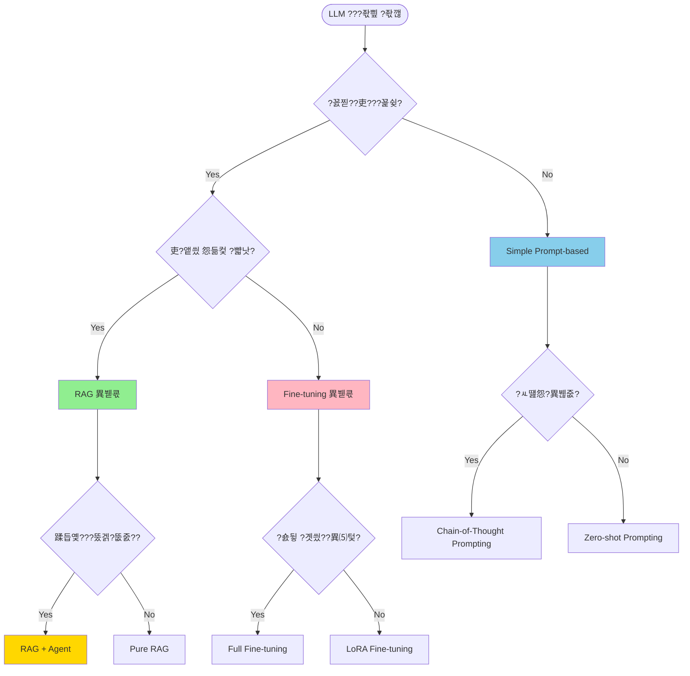

# ?쭬 LLM App Planner Skill

**Complete LLM Application Design - From Prompts to Evaluation**

> **English Summary:** Comprehensive LLM application planning skill. Helps choose app type (RAG/Agent/Fine-tuning/Prompt-based), design architecture, engineer prompts, estimate costs, define evaluation metrics, and plan fallback strategies. Includes cost calculator for all major LLM providers with 2026 pricing.

---

**LLM 湲곕컲 ?쒕퉬??湲고쉷 ?꾨Ц ?ㅽ궗 - Prompt遺€???됯?源뚯? ?꾨꼍 ?ㅺ퀎**

## 媛쒖슂

LLM???쒖슜???좏뵆由ъ??댁뀡??泥섏쓬遺€???앷퉴吏€ ?ㅺ퀎?섎뒗 ?꾨Ц ?ㅽ궗?낅땲??
- LLM ???좏삎 ?좏깮 (RAG, Agent, Fine-tuning, Prompt-based)
- ?꾪궎?띿쿂 ?ㅺ퀎
- Prompt ?붿??덉뼱留??꾨왂
- 鍮꾩슜 ?덉륫 諛?理쒖쟻??
- ?됯? 吏€???뺤쓽
- Fallback ?꾨왂

## ?ъ슜 諛⑸쾿

### 湲곕낯 ?ъ슜

```bash
/llm-app-planner "踰뺣쪧 臾몄꽌 遺꾩꽍 AI ?쒕퉬??
```

**?먮룞 ?앹꽦:**
1. LLM ???좏삎 異붿쿇 (RAG + Agent)
2. ?쒖뒪???꾪궎?띿쿂 ?ㅼ씠?닿렇??
3. Prompt ?쒗뵆由?(System, User, Few-shot)
4. 鍮꾩슜 怨꾩궛 (?붽컙 ?덉긽 API 鍮꾩슜)
5. ?됯? 硫뷀듃由?(Accuracy, Hallucination, Latency)
6. 援ы쁽 濡쒕뱶留?

### ???좏삎蹂?

```bash
# RAG (臾몄꽌 湲곕컲 Q&A)
/llm-app-planner --type rag "湲곗뾽 ?대? ?꾪궎 寃€??

# Agent (?먯쑉 ?ㅽ뻾)
/llm-app-planner --type agent "?ы뻾 怨꾪쉷 ?댁떆?ㅽ꽩??

# Fine-tuning (?꾨찓???뱁솕)
/llm-app-planner --type finetuning "?섎즺 吏꾨떒 蹂댁“"

# Prompt-based (媛꾨떒??蹂€??
/llm-app-planner --type prompt "?대찓???먮룞 ?묒꽦"
```

---

## 1. LLM ???좏삎 ?좏깮 ?꾨젅?꾩썙??

### 1.1 ?섏궗寃곗젙 ?몃━



### 1.2 ?좏삎蹂?鍮꾧탳??

| ?좏삎 | ?곹빀??寃쎌슦 | 援ы쁽 ?쒖씠??| 鍮꾩슜 | ?뺥솗??| ?덉떆 |
|------|-------------|-------------|------|--------|------|
| **Prompt-based** | 媛꾨떒???묒뾽, ?쇰컲 吏€??| 狩?| $ | 狩먥춴狩?| ?대찓???묒꽦, ?붿빟, 踰덉뿭 |
| **RAG** | ?뱀젙 臾몄꽌 湲곕컲 Q&A | 狩먥춴狩?| $$ | 狩먥춴狩먥춴 | 湲곗뾽 ?꾪궎, FAQ, 踰뺣쪧 寃€??|
| **Agent** | 蹂듭옟???뚰겕?뚮줈?? ?꾧뎄 ?ъ슜 | 狩먥춴狩먥춴 | $$$ | 狩먥춴狩먥춴 | ?ы뻾 怨꾪쉷, ?곗씠??遺꾩꽍 |
| **Fine-tuning** | ?꾨찓???뱁솕, ?쇨???以묒슂 | 狩먥춴狩먥춴狩?| $$$$ | 狩먥춴狩먥춴狩?| ?섎즺 吏꾨떒, 踰뺣쪧 ?먮Ц |
| **Hybrid (RAG+Agent)** | 吏€??異붾줎+?ㅽ뻾 | 狩먥춴狩먥춴狩?| $$$$ | 狩먥춴狩먥춴狩?| 醫낇빀 ?댁떆?ㅽ꽩??|

---

## 2. ?꾪궎?띿쿂 ?⑦꽩

### 2.1 RAG ?꾪궎?띿쿂

```
?뚢??€?€?€?€?€?€?€?€?€?€?€?€?€?€?€?€?€?€?€?€?€?€?€?€?€?€?€?€?€?€?€?€?€?€?€?€?€?€?€?€?€?€?€?€?€?€?€?€?€?€?€?€?€?€?€?€??
??                   User Query                            ??
?붴??€?€?€?€?€?€?€?€?€?€?€?€?€?€?€?€?€?€?€?р??€?€?€?€?€?€?€?€?€?€?€?€?€?€?€?€?€?€?€?€?€?€?€?€?€?€?€?€?€?€?€?€?€?€?€??
                     ??
?뚢??€?€?€?€?€?€?€?€?€?€?€?€?€?€?€?€?€?€?€?쇄??€?€?€?€?€?€?€?€?€?€?€?€?€?€?€?€?€?€?€?€?€?€?€?€?€?€?€?€?€?€?€?€?€?€?€??
??             Query Understanding                         ??
?? - Intent Classification                                 ??
?? - Entity Extraction                                     ??
?? - Query Expansion (synonyms, related terms)             ??
?붴??€?€?€?€?€?€?€?€?€?€?€?€?€?€?€?€?€?€?€?р??€?€?€?€?€?€?€?€?€?€?€?€?€?€?€?€?€?€?€?€?€?€?€?€?€?€?€?€?€?€?€?€?€?€?€??
                     ??
?뚢??€?€?€?€?€?€?€?€?€?€?€?€?€?€?€?€?€?€?€?쇄??€?€?€?€?€?€?€?€?€?€?€?€?€?€?€?€?€?€?€?€?€?€?€?€?€?€?€?€?€?€?€?€?€?€?€??
??                Retrieval                                ??
??                                                         ??
?? ?뚢??€?€?€?€?€?€?€?€?€?€?€?€?? ?뚢??€?€?€?€?€?€?€?€?€?€?€?€?? ?뚢??€?€?€?€?€?€?€?€?€?€?€?€??   ??
?? ?? Vector DB  ?? ?? Keyword    ?? ??  Graph     ??   ??
?? ??(Semantic)  ?? ?? Search     ?? ?? Traversal  ??   ??
?? ??  Weaviate  ?? ??Elasticsearch?? ??  Neo4j     ??   ??
?? ?붴??€?€?€?€?€?р??€?€?€?€?€?? ?붴??€?€?€?€?€?р??€?€?€?€?€?? ?붴??€?€?€?€?€?р??€?€?€?€?€??   ??
??        ??                ??                ??           ??
??        ?붴??€?€?€?€?€?€?€?€?€?€?€?€?€?€?€?€?쇄??€?€?€?€?€?€?€?€?€?€?€?€?€?€?€?€??           ??
??                          ??                             ??
??                 ?뚢??€?€?€?€?€?€?€?쇄??€?€?€?€?€?€?€??                    ??
??                 ??  Reranker      ??                    ??
??                 ?? (Cohere, BGE)  ??                    ??
??                 ?붴??€?€?€?€?€?€?€?р??€?€?€?€?€?€?€??                    ??
?붴??€?€?€?€?€?€?€?€?€?€?€?€?€?€?€?€?€?€?€?€?€?€?€?€?€?€?쇄??€?€?€?€?€?€?€?€?€?€?€?€?€?€?€?€?€?€?€?€?€?€?€?€?€?€?€?€?€??
                            ??
?뚢??€?€?€?€?€?€?€?€?€?€?€?€?€?€?€?€?€?€?€?€?€?€?€?€?€?€?쇄??€?€?€?€?€?€?€?€?€?€?€?€?€?€?€?€?€?€?€?€?€?€?€?€?€?€?€?€?€??
??             Context Augmentation                         ??
?? - Top-K documents (k=3-5)                               ??
?? - Metadata filtering                                    ??
?? - Citation tracking                                     ??
?붴??€?€?€?€?€?€?€?€?€?€?€?€?€?€?€?€?€?€?€?€?€?€?€?€?€?€?р??€?€?€?€?€?€?€?€?€?€?€?€?€?€?€?€?€?€?€?€?€?€?€?€?€?€?€?€?€??
                            ??
?뚢??€?€?€?€?€?€?€?€?€?€?€?€?€?€?€?€?€?€?€?€?€?€?€?€?€?€?쇄??€?€?€?€?€?€?€?€?€?€?€?€?€?€?€?€?€?€?€?€?€?€?€?€?€?€?€?€?€??
??              LLM Generation                              ??
??                                                          ??
?? System Prompt:                                           ??
?? "You are a helpful assistant. Answer based ONLY on      ??
??  the provided context. If unsure, say 'I don't know'."  ??
??                                                          ??
?? Context: [Retrieved Documents]                          ??
?? Question: [User Query]                                  ??
??                                                          ??
?? Model: GPT-4o / Claude Sonnet 4.5                      ??
?붴??€?€?€?€?€?€?€?€?€?€?€?€?€?€?€?€?€?€?€?€?€?€?€?€?€?€?р??€?€?€?€?€?€?€?€?€?€?€?€?€?€?€?€?€?€?€?€?€?€?€?€?€?€?€?€?€??
                            ??
?뚢??€?€?€?€?€?€?€?€?€?€?€?€?€?€?€?€?€?€?€?€?€?€?€?€?€?€?쇄??€?€?€?€?€?€?€?€?€?€?€?€?€?€?€?€?€?€?€?€?€?€?€?€?€?€?€?€?€??
??           Post-processing                                ??
?? - Hallucination detection                               ??
?? - Citation insertion [Source: Doc1, p.5]                ??
?? - Confidence scoring                                    ??
?붴??€?€?€?€?€?€?€?€?€?€?€?€?€?€?€?€?€?€?€?€?€?€?€?€?€?€?р??€?€?€?€?€?€?€?€?€?€?€?€?€?€?€?€?€?€?€?€?€?€?€?€?€?€?€?€?€??
                            ??
                     ?뚢??€?€?€?€?€?쇄??€?€?€?€?€??
                     ??  Response  ??
                     ?? with       ??
                     ?? Citations  ??
                     ?붴??€?€?€?€?€?€?€?€?€?€?€?€??
```

### 2.2 Agent ?꾪궎?띿쿂

```
?뚢??€?€?€?€?€?€?€?€?€?€?€?€?€?€?€?€?€?€?€?€?€?€?€?€?€?€?€?€?€?€?€?€?€?€?€?€?€?€?€?€?€?€?€?€?€?€?€?€?€?€?€?€?€?€?€?€??
??                   User Goal                             ??
?? "Book a 3-day trip to Jeju with budget $500"           ??
?붴??€?€?€?€?€?€?€?€?€?€?€?€?€?€?€?€?€?€?€?р??€?€?€?€?€?€?€?€?€?€?€?€?€?€?€?€?€?€?€?€?€?€?€?€?€?€?€?€?€?€?€?€?€?€?€??
                     ??
?뚢??€?€?€?€?€?€?€?€?€?€?€?€?€?€?€?€?€?€?€?쇄??€?€?€?€?€?€?€?€?€?€?€?€?€?€?€?€?€?€?€?€?€?€?€?€?€?€?€?€?€?€?€?€?€?€?€??
??                 Planner Agent                           ??
?? (LLM: GPT-4o)                                          ??
??                                                         ??
?? Task Decomposition:                                     ??
?? 1. Search flights to Jeju                               ??
?? 2. Find hotels ($100-150/night)                        ??
?? 3. Recommend activities                                 ??
?? 4. Create itinerary                                     ??
?붴??€?€?€?€?€?€?€?€?€?€?€?€?€?€?€?€?€?€?€?р??€?€?€?€?€?€?€?€?€?€?€?€?€?€?€?€?€?€?€?€?€?€?€?€?€?€?€?€?€?€?€?€?€?€?€??
                     ??
        ?뚢??€?€?€?€?€?€?€?€?€?€?€?쇄??€?€?€?€?€?€?€?€?€?€?€??
        ??           ??           ??
?뚢??€?€?€?€?€?€?쇄??€?€?€?€?€???뚢??€?쇄??€?€?€?€?€?€?€???뚢뼹?€?€?€?€?€?€?€?€?€?€?€?€?€?€??
?? Tool 1      ???? Tool 2    ???? Tool 3       ??
?? Flight API  ???? Hotel API ???? Activity DB  ??
?? (Skyscanner)???? (Agoda)   ???? (TripAdvisor)??
?붴??€?€?€?€?€?€?р??€?€?€?€?€???붴??€?р??€?€?€?€?€?€?€???붴뵮?€?€?€?€?€?€?€?€?€?€?€?€?€?€??
        ??           ??           ??
        ?붴??€?€?€?€?€?€?€?€?€?€?€?쇄??€?€?€?€?€?€?€?€?€?€?€??
                     ??
?뚢??€?€?€?€?€?€?€?€?€?€?€?€?€?€?€?€?€?€?€?쇄??€?€?€?€?€?€?€?€?€?€?€?€?€?€?€?€?€?€?€?€?€?€?€?€?€?€?€?€?€?€?€?€?€?€?€??
??             Executor Agent                              ??
?? (Haiku for speed)                                      ??
??                                                         ??
?? Executes tool calls:                                    ??
?? - GET /flights?from=ICN&to=CJU&date=2026-02-01        ??
?? - GET /hotels?location=jeju&budget=150                 ??
?? - Query vector DB for activities                       ??
?붴??€?€?€?€?€?€?€?€?€?€?€?€?€?€?€?€?€?€?€?р??€?€?€?€?€?€?€?€?€?€?€?€?€?€?€?€?€?€?€?€?€?€?€?€?€?€?€?€?€?€?€?€?€?€?€??
                     ??
?뚢??€?€?€?€?€?€?€?€?€?€?€?€?€?€?€?€?€?€?€?쇄??€?€?€?€?€?€?€?€?€?€?€?€?€?€?€?€?€?€?€?€?€?€?€?€?€?€?€?€?€?€?€?€?€?€?€??
??             Aggregator Agent                            ??
?? (Sonnet for reasoning)                                 ??
??                                                         ??
?? Combines results:                                       ??
?? - Flight: $250 (Korean Air, 2/1 10:00)                ??
?? - Hotel: $130/night (Shilla Stay)                      ??
?? - Activities: Seongsan Ilchulbong, Hallasan            ??
??                                                         ??
?? Creates coherent itinerary                             ??
?붴??€?€?€?€?€?€?€?€?€?€?€?€?€?€?€?€?€?€?€?р??€?€?€?€?€?€?€?€?€?€?€?€?€?€?€?€?€?€?€?€?€?€?€?€?€?€?€?€?€?€?€?€?€?€?€??
                     ??
?뚢??€?€?€?€?€?€?€?€?€?€?€?€?€?€?€?€?€?€?€?쇄??€?€?€?€?€?€?€?€?€?€?€?€?€?€?€?€?€?€?€?€?€?€?€?€?€?€?€?€?€?€?€?€?€?€?€??
??             Critic Agent (Optional)                     ??
?? Self-reflection: Does this meet budget? Feasible?      ??
?? If not ??Re-plan                                       ??
?붴??€?€?€?€?€?€?€?€?€?€?€?€?€?€?€?€?€?€?€?р??€?€?€?€?€?€?€?€?€?€?€?€?€?€?€?€?€?€?€?€?€?€?€?€?€?€?€?€?€?€?€?€?€?€?€??
                     ??
                ?뚢??€?€?€?쇄??€?€?€??
                ??Output  ??
                ??3-Day   ??
                ?괞tinerary??
                ?붴??€?€?€?€?€?€?€?€??
```

---

## 3. Prompt ?붿??덉뼱留??꾨왂

### 3.1 System Prompt ?쒗뵆由?

```markdown
## RAG System Prompt (踰뺣쪧 臾몄꽌 遺꾩꽍)

**Role:**
You are a legal document analysis AI assistant specialized in Korean corporate law.

**Task:**
Answer user questions based ONLY on the provided legal documents. Your answers must be:
- **Accurate**: Cite specific articles, sections, and page numbers
- **Precise**: Use exact legal terminology
- **Conservative**: If unsure, say "I don't have enough information" rather than guessing
- **Structured**: Use bullet points for clarity

**Guidelines:**
1. **NEVER** invent information not in the provided context
2. **ALWAYS** cite sources: [Article 123, Section 2, p.45]
3. **DISTINGUISH** between:
   - Mandatory (must, shall) vs. Optional (may, can)
   - Law vs. Regulation vs. Guideline
4. **WARN** if the document is outdated (> 2 years old)
5. **ESCALATE** to human lawyer if:
   - Question involves active litigation
   - Requires interpretation of ambiguous clauses
   - User needs official legal advice

**Output Format:**
```
**Answer:**
[Your answer here]

**Legal Basis:**
- [Citation 1]
- [Citation 2]

**Confidence:** [High/Medium/Low]

**Disclaimer:** This is AI-generated analysis, not official legal advice.
```

**Example:**

User: "Can a corporation deduct R&D expenses?"