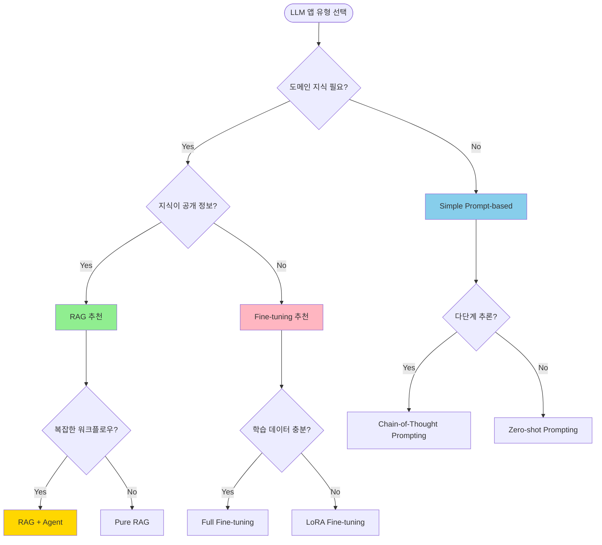

# 🧠 LLM App Planner Skill

**Complete LLM Application Design - From Prompts to Evaluation**

> **English Summary:** Comprehensive LLM application planning skill. Helps choose app type (RAG/Agent/Fine-tuning/Prompt-based), design architecture, engineer prompts, estimate costs, define evaluation metrics, and plan fallback strategies. Includes cost calculator for all major LLM providers with 2026 pricing.

---

**LLM 기반 서비스 기획 전문 스킬 - Prompt부터 평가까지 완벽 설계**

## 개요

LLM을 활용한 애플리케이션을 처음부터 끝까지 설계하는 전문 스킬입니다:
- LLM 앱 유형 선택 (RAG, Agent, Fine-tuning, Prompt-based)
- 아키텍처 설계
- Prompt 엔지니어링 전략
- 비용 예측 및 최적화
- 평가 지표 정의
- Fallback 전략

## 사용 방법

### 기본 사용

```bash
/llm-app-planner "법률 문서 분석 AI 서비스"
```

**자동 생성:**
1. LLM 앱 유형 추천 (RAG + Agent)
2. 시스템 아키텍처 다이어그램
3. Prompt 템플릿 (System, User, Few-shot)
4. 비용 계산 (월간 예상 API 비용)
5. 평가 메트릭 (Accuracy, Hallucination, Latency)
6. 구현 로드맵

### 앱 유형별

```bash
# RAG (문서 기반 Q&A)
/llm-app-planner --type rag "기업 내부 위키 검색"

# Agent (자율 실행)
/llm-app-planner --type agent "여행 계획 어시스턴트"

# Fine-tuning (도메인 특화)
/llm-app-planner --type finetuning "의료 진단 보조"

# Prompt-based (간단한 변환)
/llm-app-planner --type prompt "이메일 자동 작성"
```

---

## 1. LLM 앱 유형 선택 프레임워크

### 1.1 의사결정 트리



### 1.2 유형별 비교표

| 유형 | 적합한 경우 | 구현 난이도 | 비용 | 정확도 | 예시 |
|------|-------------|-------------|------|--------|------|
| **Prompt-based** | 간단한 작업, 일반 지식 | ⭐ | $ | ⭐⭐⭐ | 이메일 작성, 요약, 번역 |
| **RAG** | 특정 문서 기반 Q&A | ⭐⭐⭐ | $$ | ⭐⭐⭐⭐ | 기업 위키, FAQ, 법률 검색 |
| **Agent** | 복잡한 워크플로우, 도구 사용 | ⭐⭐⭐⭐ | $$$ | ⭐⭐⭐⭐ | 여행 계획, 데이터 분석 |
| **Fine-tuning** | 도메인 특화, 일관성 중요 | ⭐⭐⭐⭐⭐ | $$$$ | ⭐⭐⭐⭐⭐ | 의료 진단, 법률 자문 |
| **Hybrid (RAG+Agent)** | 지식+추론+실행 | ⭐⭐⭐⭐⭐ | $$$$ | ⭐⭐⭐⭐⭐ | 종합 어시스턴트 |

---

## 2. 아키텍처 패턴

### 2.1 RAG 아키텍처

```
┌─────────────────────────────────────────────────────────┐
│                    User Query                            │
└────────────────────┬────────────────────────────────────┘
                     │
┌────────────────────▼────────────────────────────────────┐
│              Query Understanding                         │
│  - Intent Classification                                 │
│  - Entity Extraction                                     │
│  - Query Expansion (synonyms, related terms)             │
└────────────────────┬────────────────────────────────────┘
                     │
┌────────────────────▼────────────────────────────────────┐
│                 Retrieval                                │
│                                                          │
│  ┌─────────────┐  ┌─────────────┐  ┌─────────────┐    │
│  │  Vector DB  │  │  Keyword    │  │   Graph     │    │
│  │ (Semantic)  │  │  Search     │  │  Traversal  │    │
│  │   Weaviate  │  │ Elasticsearch│  │   Neo4j     │    │
│  └──────┬──────┘  └──────┬──────┘  └──────┬──────┘    │
│         │                 │                 │            │
│         └─────────────────┼─────────────────┘            │
│                           │                              │
│                  ┌────────▼────────┐                     │
│                  │   Reranker      │                     │
│                  │  (Cohere, BGE)  │                     │
│                  └────────┬────────┘                     │
└───────────────────────────┼──────────────────────────────┘
                            │
┌───────────────────────────▼──────────────────────────────┐
│              Context Augmentation                         │
│  - Top-K documents (k=3-5)                               │
│  - Metadata filtering                                    │
│  - Citation tracking                                     │
└───────────────────────────┬──────────────────────────────┘
                            │
┌───────────────────────────▼──────────────────────────────┐
│               LLM Generation                              │
│                                                           │
│  System Prompt:                                           │
│  "You are a helpful assistant. Answer based ONLY on      │
│   the provided context. If unsure, say 'I don't know'."  │
│                                                           │
│  Context: [Retrieved Documents]                          │
│  Question: [User Query]                                  │
│                                                           │
│  Model: GPT-4o / Claude Sonnet 4.5                      │
└───────────────────────────┬──────────────────────────────┘
                            │
┌───────────────────────────▼──────────────────────────────┐
│            Post-processing                                │
│  - Hallucination detection                               │
│  - Citation insertion [Source: Doc1, p.5]                │
│  - Confidence scoring                                    │
└───────────────────────────┬──────────────────────────────┘
                            │
                     ┌──────▼──────┐
                     │   Response  │
                     │  with       │
                     │  Citations  │
                     └─────────────┘
```

### 2.2 Agent 아키텍처

```
┌─────────────────────────────────────────────────────────┐
│                    User Goal                             │
│  "Book a 3-day trip to Jeju with budget $500"           │
└────────────────────┬────────────────────────────────────┘
                     │
┌────────────────────▼────────────────────────────────────┐
│                  Planner Agent                           │
│  (LLM: GPT-4o)                                          │
│                                                          │
│  Task Decomposition:                                     │
│  1. Search flights to Jeju                               │
│  2. Find hotels ($100-150/night)                        │
│  3. Recommend activities                                 │
│  4. Create itinerary                                     │
└────────────────────┬────────────────────────────────────┘
                     │
        ┌────────────┼────────────┐
        │            │            │
┌───────▼──────┐ ┌──▼────────┐ ┌▼──────────────┐
│  Tool 1      │ │  Tool 2    │ │  Tool 3       │
│  Flight API  │ │  Hotel API │ │  Activity DB  │
│  (Skyscanner)│ │  (Agoda)   │ │  (TripAdvisor)│
└───────┬──────┘ └──┬────────┘ └┬──────────────┘
        │            │            │
        └────────────┼────────────┘
                     │
┌────────────────────▼────────────────────────────────────┐
│              Executor Agent                              │
│  (Haiku for speed)                                      │
│                                                          │
│  Executes tool calls:                                    │
│  - GET /flights?from=ICN&to=CJU&date=2026-02-01        │
│  - GET /hotels?location=jeju&budget=150                 │
│  - Query vector DB for activities                       │
└────────────────────┬────────────────────────────────────┘
                     │
┌────────────────────▼────────────────────────────────────┐
│              Aggregator Agent                            │
│  (Sonnet for reasoning)                                 │
│                                                          │
│  Combines results:                                       │
│  - Flight: $250 (Korean Air, 2/1 10:00)                │
│  - Hotel: $130/night (Shilla Stay)                      │
│  - Activities: Seongsan Ilchulbong, Hallasan            │
│                                                          │
│  Creates coherent itinerary                             │
└────────────────────┬────────────────────────────────────┘
                     │
┌────────────────────▼────────────────────────────────────┐
│              Critic Agent (Optional)                     │
│  Self-reflection: Does this meet budget? Feasible?      │
│  If not → Re-plan                                       │
└────────────────────┬────────────────────────────────────┘
                     │
                ┌────▼────┐
                │ Output  │
                │ 3-Day   │
                │Itinerary│
                └─────────┘
```

---

## 3. Prompt 엔지니어링 전략

### 3.1 System Prompt 템플릿

```markdown
## RAG System Prompt (법률 문서 분석)

**Role:**
You are a legal document analysis AI assistant specialized in Korean corporate law.

**Task:**
Answer user questions based ONLY on the provided legal documents. Your answers must be:
- **Accurate**: Cite specific articles, sections, and page numbers
- **Precise**: Use exact legal terminology
- **Conservative**: If unsure, say "I don't have enough information" rather than guessing
- **Structured**: Use bullet points for clarity

**Guidelines:**
1. **NEVER** invent information not in the provided context
2. **ALWAYS** cite sources: [Article 123, Section 2, p.45]
3. **DISTINGUISH** between:
   - Mandatory (must, shall) vs. Optional (may, can)
   - Law vs. Regulation vs. Guideline
4. **WARN** if the document is outdated (> 2 years old)
5. **ESCALATE** to human lawyer if:
   - Question involves active litigation
   - Requires interpretation of ambiguous clauses
   - User needs official legal advice

**Output Format:**
```
**Answer:**
[Your answer here]

**Legal Basis:**
- [Citation 1]
- [Citation 2]

**Confidence:** [High/Medium/Low]

**Disclaimer:** This is AI-generated analysis, not official legal advice.
```

**Example:**

User: "Can a corporation deduct R&D expenses?"